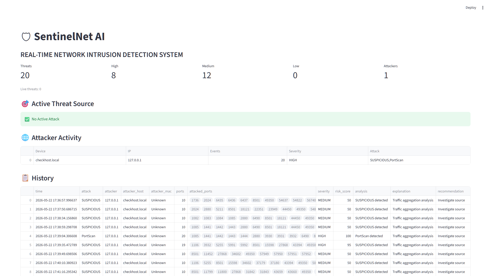

# SentinetNet

SentinetNet is a lightweight network intrusion detection and blocking toolkit that uses machine learning to detect malicious network flows and provides a simple web dashboard for visualization.

Key components
- backend/: Capture network flows, detect attacks, and optionally block traffic
  - capture.py — capture/ingest flows
  - detector.py — run inference using models/
  - blocker.py — block offending interfaces
- training/: Scripts to train models from CSV datasets
  - train_model.py
- dashboard/: Simple Flask app for visual reports (app.py)
- models/: Trained model and encoders (pkl files)
- data/: Example CSV dataset(s)

Quick start
1. (Optional) Create a virtualenv and install deps
   python -m venv .venv
   .venv\Scripts\activate
   pip install -r requirements.txt

2. Train a model (optional)
   python training\train_model.py

3. Run the detector (reads models from models/)
   python backend\detector.py

4. Run the capture/ingest (if needed)
   python backend\capture.py

5. Start the dashboard
   python dashboard\app.py
   Open http://localhost:5000 in your browser

Screenshots
Place screenshots in the `screenshots/` folder with these filenames and they will render below in supported viewers:

- screenshots/dashboard.png — dashboard view
- screenshots/alerts.png — alerts list or CSV report
- screenshots/detection-example.png — example detection log

Example Markdown to embed screenshots:

If you want me to add actual screenshots to the repo, upload the image files or allow me to generate placeholders and I'll add them into `screenshots/`.

Notes
- Models and encoders are pre-saved in models/*.pkl. If you retrain, back them up.
- alerts.json contains sample alert data used by the dashboard.

NPM Package
This repository now includes a Node wrapper package so projects can run SentinelNet from Node environments.

Install locally (from repo root):

  npm install -g .

Usage (CLI):

  sentinetnet --iface "<interface name>"

Usage (programmatic):

  const Sentinet = require('sentinetnet');
  const s = new Sentinet({ iface: 'eth0', pythonPath: 'python' });
  s.on('alert', a => console.log('ALERT', a));
  s.start();

Cross-platform note
- The Python capture script accepts --iface or the SENTINET_INTERFACE env var. If not provided, scapy's default interface is used (listens on available interfaces). This makes the tool universal across servers.

Contributing
Open an issue or submit a PR with bug fixes or improvements.

License
This project is MIT licensed (see LICENSE file).
